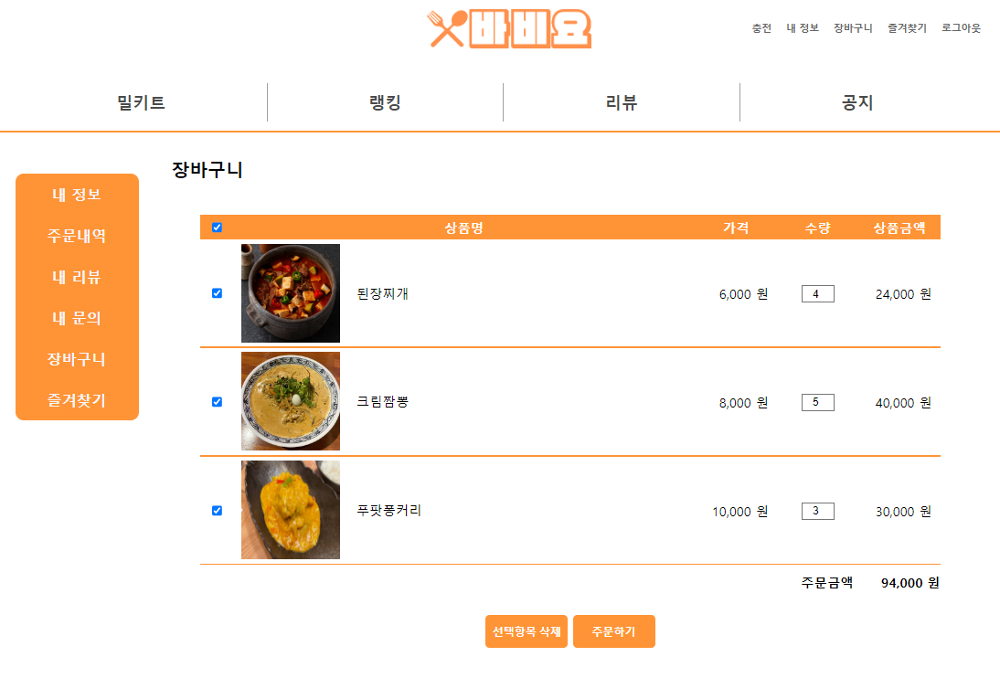
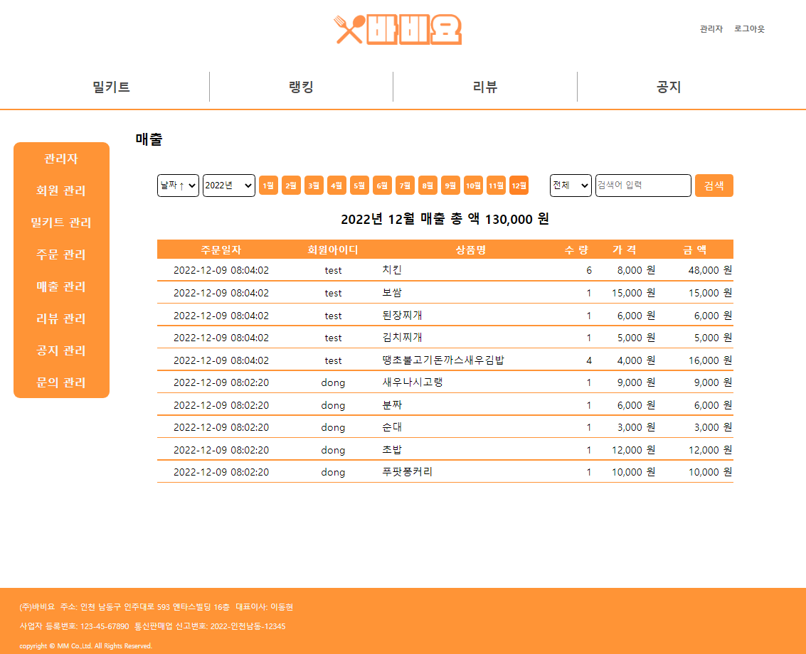

# TeamMM Project

## 1. 어떤 프로젝트인가?

'바비요'는 밀키트를 판매하는 쇼핑몰이다.   
코로나19로 인해서 집에서 직접 요리하는 경우가 증가하고 있고, 그로 인해 밀키트 시장이 급성장 중이다.   
요리 실패를 꺼려하는 소비자들에게 볶거나 끓이는 등의 단순한 과정만으로 양질의 요리 경험을 제공한다.   
바비요는 밀키트 판매로 서버 유지보수 비용 및 수익을 창출한다.

## 2. 팀원의 역할
   
팀장 이동현: UI 설계, 주문관리, 매출관리, 장바구니 기능   
팀원 김재섭: 화면 레이아웃, 제품관리, 리뷰관리, 문서관리   
팀원 이재현: DB설계, 회원관리, 캐시관리   
팀원 조윤성: 형상관리, 공지관리, 문의관리, 랭킹기능   

## 3 .개발환경/기술스택은?

개발환경
* STS
* Eclipse IDE for enterprise Java Developers(2020-06)
* Apache Tomcat 8.0
* jsp
* Servlet
* Mybatis
* Maven 3.8.6
* GitHub

기술스택

* Java(jdk 1.8.0)
* spring Framework / MVC 아키텍처 패턴
* Oracle 11g XE
* javascript
* jQuery
* HTML5
* CSS
* AJAX

## 4. ERD설계
<pre style="background-color: #fff">
   <code>
</img>   
   </code>
</pre>
## 5. 완성된 화면
<pre>
   <code>
      

     		
로그인 화면
 
         </img>  
     	

     	

     		
회원가입 화면
 
         </img>  
     	

     	

     		
메인화면 화면
 
         </img>  
     	

     	

     		
밀키트 화면
 
         </img>  
     	

     	

     		
밀키트 상세 화면
 
         </img>  
     	

     	

     		
주문 화면
 
         </img>  
     	

     	

     		
랭킹 화면
 
         </img>  
     	

     	

     		
리뷰 화면
 
         </img>  
     	

     	

     		
공지 화면
 
         </img>  
     	

     	

     		
즐겨찾기 화면
 
         </img>  
     	

     	

     		
장바구니 화면
 
         </img>  
     	

     	

     		
캐시 화면
 
         </img>  
     	
 
        	

     		
문의 화면
 
         </img>  
     	
 
        	

     		
관리자 홈 화면
 
         </img>  
     	
 
        	

     		
매출 관리 화면
 
         </img>  
     	
 
   </code>
</pre>

   

